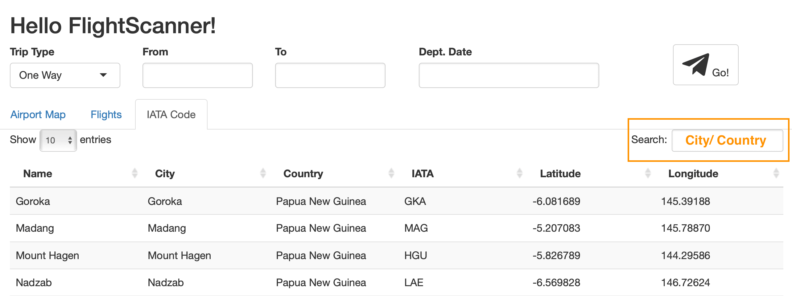

```{r setup, include=FALSE}
knitr::opts_chunk$set(echo = TRUE)
```

## Instruction to using the Shiny App

The Shiny App for the `flightscanner` has mainly three tabs: **Airport Map**, **Flights** and **IATA Code**.

### Airport Map

It is set to the welcome page by default. The map from `leaflet` would show the accurate position of the ariport you choose. It could provide a rough intuition that how far the user would need to travel.

There are four input boxes on the top of the map. If the user wants to make a flight search, these values should be provided.

**Trip type**: one-way tirp or round trip.

**From**, **To**: 3-character code for the airports the user would like to start from and end at.

**Dept.Date**, **Arr.Date**: small calendar would be shown so that the user could choose the specific date for leaving and arriving. **Arr.Date** box would appear only when the user choose a **round trip**.

After the user makes sure that the App has been given the right information, he/she can click the **Go!** button with the cute paper plane and then wait for the data scrape, cleaning and filtering.

```{r, out.width='100%', echo=FALSE, eval=TRUE}
knitr::include_graphics('shiny2.png')
```

### Flights

Once the App indicates that "Search succeeded! Click Flight Tab For More Details:)", the user could then have a check on this module.

There are several filter options on the left panel.

**Price**: a slider ranging from the maximum to the minimum of the ticket price.

**Airlines Includes**, **Airlines Excludes**: the user can delete or keep the airlines that you want to include or exclude.

**Duration**: the time required for a specific flight.

**Stops**: the user can choose the preferences for the number of transit stops.

**Layover**: the total time the user will spend at the transit stops.

**Outbound, Inbound**: the user could choose the specific range of time for the departure time and arrival time, for both outbound flight and inbound flight using a 24-hour clock.

```{r, out.width='100%', echo=FALSE, eval=TRUE}
knitr::include_graphics('shiny3.png')
```

A datatable containing some important and detailed inforamtion about the filtered filghts would be given on the right panel, including accurate total price, leaving and arriving time for inbound and/or outbound flight, duration and number of stops of inbound and/or outbound. There is also hyperlinks for the ticket booking on the agent websites in the column of **Link**.

### IATA Code

If the user has no idea what the 3-character codes for the airports he/she would visit, this tab could help find the codes. Use the search box on the right and feed it with the name of the city or country, the data from `MUCflight` would provide the desired information.

```{r, out.width='100%', echo=FALSE, eval=TRUE}

```