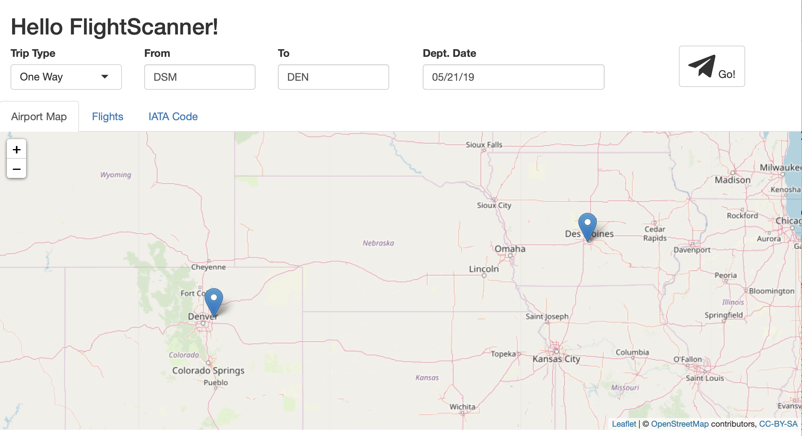
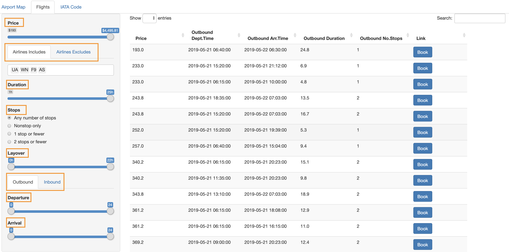

```{r, include=FALSE, message=FALSE}
library(dplyr)
library(httr)
```

## Introduction

Finding the cheapest flight from point A to point B could be a headache for many of us, especially with other multiple constraints, such as duration, layover, departure and arrival time, etc. The goal of the `flightscanner` package is to provide a simple and straightforward interface for interacting with [Rapid API -- Skyscanner](https://rapidapi.com/skyscanner/api/skyscanner-flight-search) through R. The Skyscanner API lets users to search for flight and query flight prices from Skyscanner's database, as well as quotes from ticketing agencies.  Besides these basic functionalities as a flight searching tool, `flightscanner` also allows users to schedule searches and record results antomatically. In addition, this package provides a Shiny APP to visualize the trip on a map and to show the available ticket options according to the customized constraints. 


```{r, include = FALSE}
knitr::opts_chunk$set(
  collapse = TRUE,
  comment = "#>",
  fig.align = "center"
)
```

## Getting Started with flightscanner

At the time of this writing, `flightscanner` has not been submitted to CRAN. Right now, the `flightscanner` package can be easily installed through the `devtools` package with the function `install_github()`.

```r
devtools::install_github("MinZhang95/flightscanner")
```

```{r}
library(flightscanner)
```

```{r,echo=FALSE}
apiSetKey("a01b3ec5e9msh2698ef80ca5232dp18fc92jsnddf5fad0cc7d")
```

### Setup with API key

The first step in using the `flightscanner` package is to initialized the API connection to Skyscanner. 
If this is your first time of loading this package, you will be required to pass the API key received from Skyscanner into the console. 
Two questions will be prompted for users to quickly setup the API:

```r
API key is required!
Please follow the instructions to get the key:
1. Browse and login:  https://rapidapi.com/skyscanner/api/skyscanner-flight-search 
   Do you want to visit this website (1 for YES; 0 for NO)?
   
2. Copy the value of X-RapidAPI-Key in Header Parameters.
   Paste your key (without quote):
   
```

By selecting "1" for the first question, the users will be directed to the Rapid API Skyscanner webpage, where the API key can be found in the right panel (Figure 1) and be used for the second question. 

```{r, out.width='100%', echo=FALSE, eval=TRUE, fig.cap="Figure 1: Rapid API Skyscanner and API-key"}
knitr::include_graphics('APIwebpage.JPG')
```

A welcome message will show up with a valid API key:

```r
Welcome to FlightScanner!
```

The valid API key will be stored into "APIkey.txt" under the current working directory, so that the API key will not be required again and again everytime when the package is loaded. 

However, with an invalid API key, a failure message will show up:

```r
Check your key or network connection. And use function `apiSetKey` to set key later.
```

Alternatively, the users could set (or reset) the API key manually with the function 'apiSetKey':

```r
flightscanner::apiSetKey("YOUR KEY")
```

Please notice that `apiSetKey` does not generate or rewrite 'APIkey.txt' under the current working directory.

To obtain the global API key, use the function 'apiGetKey':

```r
fligthscanner::apiGetKey()
```

This function will return the API key only if it has been successfully setup; otherwise it will return 'NULL'.

## Main Functions

### Download data with API

#### `apiCreateSession`

`apiCreateSession` allows the users to input their flight information (origin, destination and dates) and create a session on the API server. The output contains a session ID. For example, to buy a ticket from Des Moines to Seattle for an adult on 2019-07-20 (the departure date cannot be earlier than the current date):

```{r}
dsm2sea_session <- 
  apiCreateSession(origin = "DSM", destination = "SEA", startDate = "2019-07-20", adults = 1)
```

The output of `apiCreateSession` is used as the input of `apiPollSession`.

#### `apiPollSession`

`apiPollSession` retrieves the flight data searched with `apiCreateSession` and allows the users to sort and filter the tickets by various standards. The default values of all filter variables are `NULL`, meaning that we do not filter anything before we obtain the actual data. For example, to search the previous result in price ascending order:

```{r}
dsm2sea_res <- apiPollSession(response = dsm2sea_session, sortType = "price", sortOrder = "asc")
```

Let's check the content of the output of `apiPollSession`:

```{r}
dsm2sea_res %>% content %>% names
```

The output of `apiPollSession` is messy, because it contains several sub-lists, such as "itineraries", "legs", and "segments". The relationship between these terms are shown below.

$$
\text{searching result} 
\begin{cases}
  \text{itinerary_1} 
    \begin{cases}
      \text{leg_1} 
        \begin{cases}
          \text{segment_1} \\
          \text{segment_2} \\
          \vdots \\
          \text{segment_S}
        \end{cases} \\
      \text{leg_2} 
        \begin{cases}
          \text{segment_1}
        \end{cases}
    \end{cases} \\
  \text{itinerary_2} 
    \begin{cases}
      \text{leg_1} 
        \begin{cases}
          \text{segment_1} \\
          \text{segment_2} 
        \end{cases} \\
      \text{leg_2} 
        \begin{cases}
          \text{segment_1}
        \end{cases}
    \end{cases} \\
  \vdots \\
  \text{itinerary_n} 
    \begin{cases}
      \text{leg_1} 
        \begin{cases}
          \text{segment_1} 
        \end{cases} \\
      \text{leg_2} 
        \begin{cases}
          \text{segment_1}
        \end{cases}
    \end{cases}
\end{cases}
$$

One searching request may contain several itineraries. A one-way trip contains one leg, whereas a round-way trip contains two: outbound leg and inbound leg. One leg contains several segments if it not a direct flight. 

### Data Processing 

#### `flightGet`

`flightGet` allows users to input the result from `PollSession` or to read from database (explain later in "Data Storage" section). The output contains a list of seven dataframes, whose names are printed below:

```{r}
dsm2sea_df <- dsm2sea_res %>% flightGet()
names(dsm2sea_df)
```

The dataframe "price" provides information, such as the seraching time and pricing options:

```{r}
dsm2sea_df$price %>% head(3) %>% print(width = 120)
```

Within the same itinerary, there might be several different prices due to different agents:

```{r}
dsm2sea_df$price$PricingOptions[[3]] %>% head(3) %>% print(width = 120)
```

The dataframe "leg" provides information, such as duration and number of stops:

```{r}
dsm2sea_df$legs %>% head(3) %>% print(width = 120)
```

We can also check the stop information and the layover in minutes with the "leg" dataframe for each leg:

```{r}
dsm2sea_df$legs$Stops %>% head(3) %>% print(width = 120)
```

Similarly, the detailed results about the segments are stored in the "segments" dataframe:

```{r}
dsm2sea_df$segments %>% head(2) %>% print(width = 120)
```

In the above outputs, the carriers and stops are represented with their IDs. To "translate" to their names, run:

```{r}
dsm2sea_df$carriers %>% head(1) %>% print(width = 120)
dsm2sea_df$places %>% head(1) %>% print(width = 120)
```

#### `flightFilter`

`flightFilter` allows users to filter the results obtained from `flightGet`. Continued with the previous example, the user looks for flights with a budget of $1,000, no more than 1 stop, and departure time after 8:00 am:

```{r}
flightFilter(dsm2sea_df, max_price = 1000, max_stops = 1, out_departure = c("08:00","24:00")) %>% head(3)
```

### Data Storage

We want to scrape and save data for a period to see the price change over time. Thus, here several functions are made to generate database.

#### `dbCreateDB`

**'dbCreateDB'** is a function to connect with SQLite driver and to generate a local database file 'flight.db':

```r
dbCreateDB(conn = RSQLite::SQLite(), dbname = "flight.db")
```

The flight.db includes seven tables:
```{r,echo=FALSE}
con <- dbCreateDB(dbname = "flight.db")
dbListTables(con)
```

#### `dbSaveData`

**'dbSaveDB'** is a function to save data from the request response into the databse 'flight.db'. 
```r
resp <- apiCreateSession(origin = "SFO", destination = "LHR", startDate = "2019-07-01")
resp <- apiPollSession(resp)
data <- flightGet(resp)

# Connect to SQLite database
con <- dbCreateDB(dbname = ":memory:")
dbSaveData(resp, con)  # from response
dbSaveData(data, con)  # from list
dbDisconnect(con)
```

## Automatic Data Download

A feature that makes the `flightscanner` package unique, compared with the existing flight searching engines, is its functionality of automatic flight enquiry according to a schedule, which is realized with the **'cron_create'** function. Besides the regular flight information (such as orgin, destination, and dates), another input `frequency` is needed for the job schedule. It could be "minutely", "hourly", "daily" or other frequencies defined by `cronR`'s syntax. Here is an example of using `cron_create`:

```r
cron_create("DSM", "SEA", "2019-07-20", frequency = "daily", at = "3AM")
```

The outputs of runing `cron_create` are a log file and a database file.
All of the scheduled searching results are contained in the database 'flight.db'. 

```{r}
# connect to SQLite database
con <- dbCreateDB(dbname = "flight.db")
# read data from database
data <- flightGet(con)  
# show the searching time
unique(data$price$SearchTime)
# disconnect database
dbDisconnect(con)
```

To show the current searching jobs, run the function:
```r
cron_ls()
```

To clear the current searching jobs, run the function:
```r
cron_clear(ask = FALSE)
```

## Shiny App

The Shiny App for the `flightscanner` includes three tabs: **Airport Map**, **Flights** and **IATA Code**.

### Airport Map

It is used as the welcome page by default. The map from `leaflet` shows the accurate locations of the target airports. It could provide a rough intuition about how far the users need to travel. 

There are four input boxes on the top of the map. If the user wants to make a flight search, these values should be provided.

**Trip type**: one-way tirp or round trip.

**From**, **To**: 3-character code for the airports the user would like to start from and end at.

**Dept.Date**, **Arr.Date**: small calendar would be shown so that the user could choose the specific date for leaving and arriving. **Arr.Date** box would appear only when the user choose a **round trip**.

After the user makes sure that the App has been given the right information, he/she can click the **Go!** button with the cute paper plane and then wait for the data scrape, cleaning and filtering.

```{r, out.width='100%', echo=FALSE, eval=TRUE}

```

### Flights

Once the App indicates that "Search succeeded! Click Flight Tab For More Details:)", the user could then have a check on this module.

There are several filter options on the left panel.

**Price**: a slider ranging from the maximum to the minimum of the ticket price.

**Airlines Includes**, **Airlines Excludes**: the user can delete or keep the airlines that you want to include or exclude.

**Duration**: the time required for a specific flight.

**Stops**: the user can choose the preferences for the number of transit stops.

**Layover**: the total time the user will spend at the transit stops.

**Outbound, Inbound**: the user could choose the specific range of time for the departure time and arrival time, for both outbound flight and inbound flight using a 24-hour clock.

```{r, out.width='100%', echo=FALSE, eval=TRUE}

```

A datatable containing some important and detailed inforamtion about the filtered filghts would be given on the right panel, including accurate total price, leaving and arriving time for inbound and/or outbound flight, duration and number of stops of inbound and/or outbound. There is also hyperlinks for the ticket booking on the agent websites in the column of **Link**.

### IATA Code

If the user has no idea what the 3-character codes for the airports he/she would visit, this tab could help find the codes. Use the search box on the right and feed it with the name of the city or country, the data from `MUCflight` would provide the desired information.

