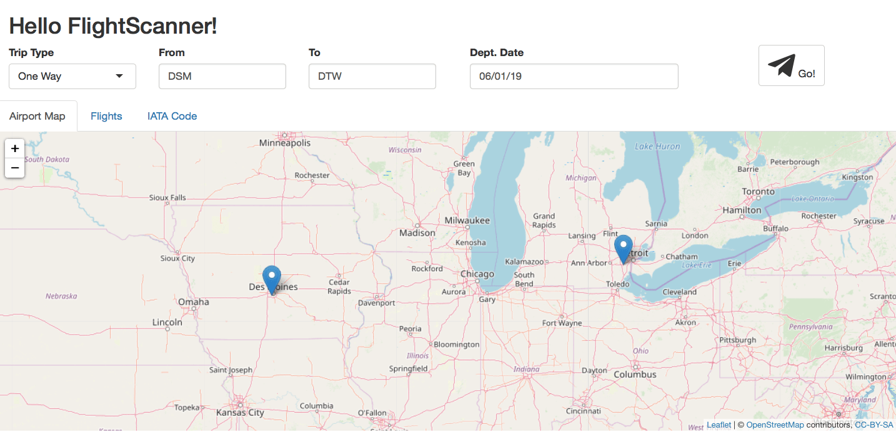
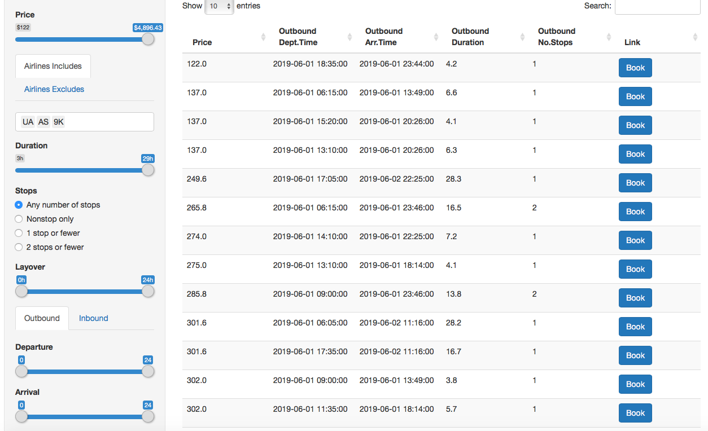
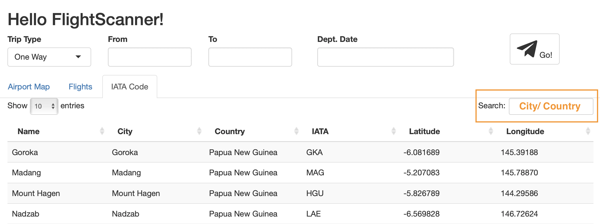

```{r, include=FALSE, message=FALSE}
library(dplyr)
library(httr)
```

## Introduction
Finding the cheapest flight from point A to point B could be a headache for many of us, especially with other multiple constraints, such as duration, layover, departure and arrival time, etc. The goal of the `flightscanner` package is to provide a simple and straightforward interface for interacting with [Rapid API -- Skyscanner](https://rapidapi.com/skyscanner/api/skyscanner-flight-search) through R. The Skyscanner API lets users to search for flight and query flight prices from Skyscanner's database, as well as quotes from ticketing agencies.  Besides these basic functionalities as a flight searching tool, `flightscanner` also allows users to schedule searches and record results antomatically. In addition, this package provides a Shiny APP to visualize the trip on a map and to show the available ticket options according to the customized constraints. 

```{r, include = FALSE}
knitr::opts_chunk$set(
  collapse = TRUE,
  comment = "#>",
  fig.align = "center"
)
```

## Getting Started with flightscanner
At the time of this writing, `flightscanner` has not been submitted to CRAN. Right now, the `flightscanner` package can be easily installed through the `devtools` package with the function `install_github()`.

```r
devtools::install_github("MinZhang95/flightscanner")
```

```{r}
library(flightscanner)
```

```{r,echo=FALSE}
apiSetKey("a01b3ec5e9msh2698ef80ca5232dp18fc92jsnddf5fad0cc7d")
```

### Setup with API key
The first step in using the `flightscanner` package is to initialized the API connection to Skyscanner. 
If this is your first time of loading this package, you will be required to pass the API key received from Skyscanner into the console. 
Two questions will be prompted for users to quickly setup the API:

```r
API key is required!
Please follow the instructions to get the key:
1. Browse and login:  https://rapidapi.com/skyscanner/api/skyscanner-flight-search 
   Do you want to visit this website (1 for YES; 0 for NO)?
   
2. Copy the value of X-RapidAPI-Key in Header Parameters.
   Paste your key (without quote):
```

By selecting "1" for the first question, the users will be directed to the Rapid API Skyscanner webpage, where the API key can be found in the right panel (Figure 1) and be used for the second question. 

```{r, out.width='100%', echo=FALSE, eval=TRUE, fig.cap="Figure 1: Rapid API Skyscanner and API-key"}
knitr::include_graphics('APIwebpage.png')
```

A welcome message will show up with a valid API key:

```r
Welcome to FlightScanner!
```

The valid API key will be stored into "APIkey.txt" under the current working directory, so that the API key will not be required again and again everytime when the package is loaded. 

However, with an invalid API key, a failure message will show up:

```r
Check your key or network connection. And use function `apiSetKey` to set key later.
```

Alternatively, the users could set (or reset) the API key manually with the function `apiSetKey()`:

```r
apiSetKey("YOUR KEY")
```

Please notice that `apiSetKey()` does not generate or rewrite "APIkey.txt" under the current working directory.

To obtain the global API key, use the function `apiGetKey()`:

```r
apiGetKey()
```

This function will return the API key only if it has been successfully setup; otherwise it will return `NULL`.

## Main Functions
### Download data with API
#### `apiCreateSession()`
`apiCreateSession()` allows the users to input their flight information (origin, destination and dates) and create a session on the API server. The output contains a session ID. For example, to buy a ticket from Des Moines to Detroit for an adult on 2019-06-01 (the departure date cannot be earlier than the current date):

```{r}
dsm2dtw_session <- 
  apiCreateSession(origin = "DSM", destination = "DTW", startDate = "2019-06-01", adults = 1)
```

The output of `apiCreateSession()` is used as the input of `apiPollSession()`.

#### `apiPollSession()`
`apiPollSession()` retrieves the flight data searched with `apiCreateSession()` and allows the users to sort and filter the tickets by various standards. The default values of all filter variables are `NULL`, meaning that we do not filter anything before we obtain the actual data. For example, to search the previous result in price ascending order:

```{r}
dsm2dtw_res <- apiPollSession(response = dsm2dtw_session, sortType = "price", sortOrder = "asc")
```

Let's check the content of the output of `apiPollSession()`:

```{r}
dsm2dtw_res %>% content %>% names
```

The output of `apiPollSession()` is messy, because it contains several sub-lists, such as "itineraries", "legs", and "segments". The relationship between these terms are shown below.

$$
\text{searching result} 
\begin{cases}
  \text{itinerary_1} 
    \begin{cases}
      \text{leg_1} 
        \begin{cases}
          \text{segment_1} \\
          \text{segment_2} \\
          \vdots \\
          \text{segment_S}
        \end{cases} \\
      \text{leg_2} 
        \begin{cases}
          \text{segment_1}
        \end{cases}
    \end{cases} \\
  \text{itinerary_2} 
    \begin{cases}
      \text{leg_1} 
        \begin{cases}
          \text{segment_1} \\
          \text{segment_2} 
        \end{cases} \\
      \text{leg_2} 
        \begin{cases}
          \text{segment_1}
        \end{cases}
    \end{cases} \\
  \vdots \\
  \text{itinerary_n} 
    \begin{cases}
      \text{leg_1} 
        \begin{cases}
          \text{segment_1} 
        \end{cases} \\
      \text{leg_2} 
        \begin{cases}
          \text{segment_1}
        \end{cases}
    \end{cases}
\end{cases}
$$

One searching request may contain several itineraries. A one-way trip contains one leg, whereas a round-way trip contains two: outbound leg and inbound leg. One leg contains several segments if it is not a direct flight. 

### Data Processing 
#### `flightGet()`
`flightGet()` allows users to input the result from `PollSession()` or to read from database (explain later in "Data Storage" section). The output contains a list of seven dataframes, whose names are printed below:

```{r message=FALSE}
dsm2dtw_df <- dsm2dtw_res %>% flightGet()
names(dsm2dtw_df)
```

The dataframe "price" provides information, such as the seraching time and pricing options:

```{r}
dsm2dtw_df$price %>% head(3) %>% print(width = 120)
```

Within the same itinerary, there might be several different prices due to different agents:

```{r}
dsm2dtw_df$price$PricingOptions[[39]] %>% print(width = 120)
```

The dataframe "leg" provides information, such as duration and number of stops:

```{r}
dsm2dtw_df$legs %>% head(3) %>% print(width = 120)
```

We can also check the stop information and the layover in minutes with the "leg" dataframe for each leg:

```{r}
dsm2dtw_df$legs$Stops %>% head(3) %>% print(width = 120)
```

Similarly, the detailed results about the segments are stored in the "segments" dataframe:

```{r}
dsm2dtw_df$segments %>% head(2) %>% print(width = 120)
```

In the above outputs, the carriers and stops are represented with their IDs. To "translate" to their names, run:

```{r}
dsm2dtw_df$carriers %>% head(1) %>% print(width = 120)
dsm2dtw_df$places %>% head(1) %>% print(width = 120)
```

#### `flightFilter()`
`flightFilter()` allows users to filter the results obtained from `flightGet()`. Continued with the previous example, the user looks for flights with a budget of $1,000, no more than 1 stop, and departure time after 8AM:

```{r}
flightFilter(dsm2dtw_df, max_price = 1000, max_stops = 1, out_departure = c("08:00","24:00")) %>% head(3)
```

### Data Storage
Storing flight data as database can be efficient for automatic searching. 

#### `dbCreateDB()`
`dbCreateDB()` is a function to connect to the local database file, default is "flight.db". This is the pre-configuration before saving data in database.

```r
dbCreateDB(conn = RSQLite::SQLite(), dbname = "flight.db")
```

The flight.db includes seven tables:
```{r,echo=FALSE}
con <- dbCreateDB(dbname = "flight.db")
dbListTables(con)
```

It will excute:

1. connect to SQLite driver.
2. create a local database file if it doesn't exist.
3. create the schema of above seven tables if they don't exist.

#### `dbSaveData`
**`dbSaveDB`** is a function to save data into the databse file.

```r
resp <- apiCreateSession(origin = "DSM", destination = "DTW", startDate = "2019-06-01")
resp <- apiPollSession(resp)
data <- flightGet(resp)

# Connect to SQLite database
con <- dbCreateDB(dbname = ":memory:")
dbSaveData(resp, con)  # from response
dbSaveData(data, con)  # from list
dbDisconnect(con)
```

It accepts two classes of inputs: `response` or `list`. `response` is the request response got by `apiPollSession()`. `list` is the data got by `flightGet()`.

## Automatic Data Download
### Important Notice
A feature that makes the `flightscanner` package unique, compared with the existing flight searching engines, is its functionality of automatic flight enquiry according to a schedule.

This part of functions only works on **Unix/Linux/MacOS**, not Windows. In the future, we will add Windows part.

If you use **MacOS** and meet the problem of "Operation not permitted". Follow the instructions:

1. Pull down the Apple menu and choose "System Preferences"
2. Choose "Security & Privacy" control panel
3. Now select the "Privacy" tab, then from the left-side menu select "Full Disk Access"
4. Click the lock icon in the lower left corner of the preference panel and authenticate with an admin level login
5. Now click the [+] plus button to add an application with full disk access
6. Navigate to the /Applications/ folder and choose "RStudio.app" or "R" to grant it with Full Disk Access privileges
7. Relaunch RStudio or R, the "Operation not permitted" error messages will be gone

### Create and Manage Jobs
Creating Cron jobs is realized with the `cron_create()` function. Besides the regular flight information (such as orgin, destination, and dates), another input "frequency" is needed for the job schedule. It could be "minutely", "hourly", "daily" or other frequencies defined by Cron's syntax, see [link](https://en.wikipedia.org/wiki/Cron). Here is an example:

```r
cron_create("DSM", "SEA", "2019-07-20", frequency = "hourly")  # this is the example
cron_create("DSM", "PVG", "2019-06-01", frequency = "0 */2 * * *")  # every 2 hours
```

This function will generate a log file and a database file. All of the scheduled searching results are contained in this database file, e.g. "flight.db".

```{r}
# connect to SQLite database
con <- dbCreateDB(dbname = "flight.db")
# read data from database
data <- flightGet(con)  
# show the searching time
unique(data$price$SearchTime)
# disconnect database
dbDisconnect(con)
```

To show the current searching jobs, run the function:

```r
cron_ls()
```

The job will be automatically excuted even if `R` is closed or the computer is restarted. To stop the job, run:

```r
cron_clear(ask = FALSE)
```

## Shiny App
To open the Shiny App, run:
```r
shiny::runApp(system.file(package = "flightscanner", "shiny"))
```

The Shiny App for the `flightscanner` includes three tabs: **Airport Map**, **Flights** and **IATA Code**.

### Airport Map
It is used as the welcome page by default. The map from `leaflet` shows the accurate locations of the target airports. It could provide a rough intuition about how far the users need to travel. 
Input values are needed on the top of the map when doing a flight search:

- **Trip type**: one-way tirp or round trip.
- **From**, **To**: 3-character code for the departure/destination airport.
- **Dept.Date**, **Arr.Date**: departure date (no earlier than the current date) and return date (no earlier than the departure date). **Arr.Date** box would appear only when the **round trip** is selected. 

Click on the **Go!** button after providing the trip information. 

```{r, out.width='100%', echo=FALSE, eval=TRUE}

```

### Flights
Click on the Flight tab after the search is complete. 
There are several filter options on the left panel.

- **Price**: a slider ranging from the minimum to the maximum of the ticket prices.
- **Airlines Includes**, **Airlines Excludes**: the users can include or exclude some specific airlines.
- **Duration**: a slider ranging from the minimum to the maximum of the trip duration.
- **Stops**: the users can specify their preferences to the number of stransition stops.
- **Layover**: the total time to be spent at the transition stops. 
- **Outbound, Inbound**: the users can choose a range of time for the departure time and arrival time, for both outbound flight and inbound flight using a 24-hour clock.

```{r, out.width='100%', echo=FALSE, eval=TRUE}

```

A table containing the detailed inforamtion about the filtered filghts will be given on the right main panel, including the ticket price, departure and arrival time for inbound and/or outbound flight, duration, and the number of stops for inbound and/or outbound. There are also hyperlinks to the ticketing agencies in the column of **Link**.

### IATA Code
Under this tab, users can search for the 3-character codes for the target airports by providing city or country names in the searching box in the upper right corner. The data comes from `MUCflight`.

```{r, out.width='100%', echo=FALSE, eval=TRUE}

```

